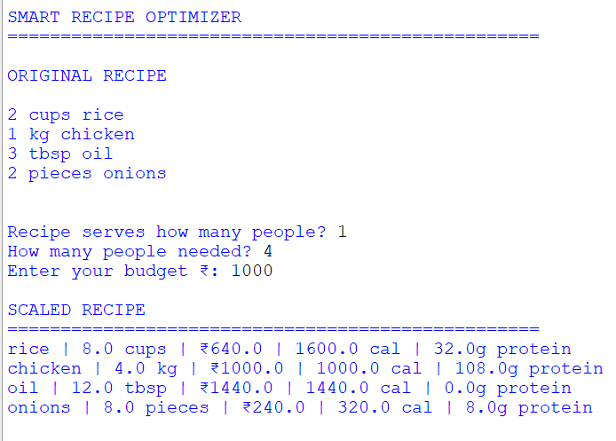
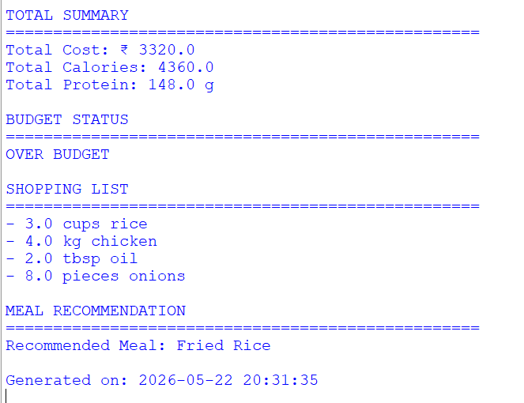

# Smart Recipe Optimizer

## Project Overview

Smart Recipe Optimizer is a Python-based application that helps users manage recipes efficiently. The program can parse recipe ingredients, scale recipes based on the number of servings, calculate total cost and nutrition values, generate shopping lists, and recommend meals using available pantry items.

This project demonstrates the use of:
- Python Programming
- Regular Expressions (Regex)
- NumPy Arrays
- Dictionaries and Lists
- Functions and Modular Programming

---

# Features

- Parse recipe ingredients automatically using Regex
- Scale recipes according to required servings
- Calculate:
  - Total Cost
  - Total Calories
  - Total Protein
- Generate a shopping list based on pantry availability
- Budget checking system
- Simple meal recommendation system

---

# Technologies Used

- Python 3
- NumPy
- Regex (re module)
- Datetime module

---

# Project Structure

smart-recipe-optimizer/
│
├── main.py
└── README.md

---

# Ingredient Database

The program contains an ingredient database with:
- Price
- Calories
- Protein values
- Diet type information

Example:
- Rice
- Chicken
- Oil
- Onions

---

# Pantry Management

The pantry system tracks available ingredients and automatically determines which ingredients need to be purchased.

Example Pantry:
- Rice
- Oil

---

# How the Program Works

1. User enters:
   - Original servings
   - Required servings
   - Budget

2. Program:
   - Parses recipe ingredients
   - Scales quantities
   - Calculates nutrition and cost
   - Generates shopping list
   - Checks budget
   - Recommends meals

---

# Sample Recipe

2 cups rice
1 kg chicken
3 tbsp oil
2 pieces onions

---

# Sample Output

---

# Learning Outcomes

Through this project, the following concepts were practiced:
- Python Functions
- Dictionaries
- Arrays using NumPy
- Regular Expressions
- Input/Output Handling
- Basic Data Processing
- Budget and Inventory Logic

---

# Future Improvements

Possible future enhancements:
- Graphical User Interface (GUI)
- Database Integration
- AI-based Meal Recommendations
- Online Grocery API Integration
- Nutritional Analysis Dashboard

---

# Author

Developed as a Python mini-project for learning and academic purposes.

---

# License

This project is open-source and free to use for educational purposes.
